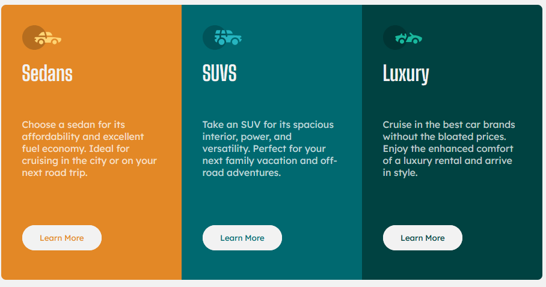

# Frontend Mentor - 3-column preview card component solution

This is a solution to the [3-column preview card component challenge on Frontend Mentor](https://www.frontendmentor.io/challenges/3column-preview-card-component-pH92eAR2-). Frontend Mentor challenges help you improve your coding skills by building realistic projects.

## Table of contents

- [Frontend Mentor - 3-column preview card component solution](#frontend-mentor---3-column-preview-card-component-solution)
  - [Table of contents](#table-of-contents)
  - [Overview](#overview)
    - [The challenge](#the-challenge)
    - [Screenshot](#screenshot)
    - [Links](#links)
  - [My process](#my-process)
    - [Built with](#built-with)
    - [What I learned](#what-i-learned)
  - [Author](#author)

## Overview

### The challenge

Users should be able to:

- View the optimal layout depending on their device's screen size
- See hover states for interactive elements

### Screenshot

### Links

- [Code](https://github.com/zougari47/3-column-preview-card-component-main)
- [Live Demo](https://zougari47.github.io/3-column-preview-card-component-main/)

## My process

### Built with

- HTML
- CSS

### What I learned

I practice flexBox layout, change flex direction on tablet/desktop screen.

## Author

- codePen - [@zougari47](https://codepen.io/zougari47)
- Frontend Mentor - [@zougari47](https://www.frontendmentor.io/profile/zougari47)
- Twitter - [@zougari47](https://www.twitter.com/zougari47)
